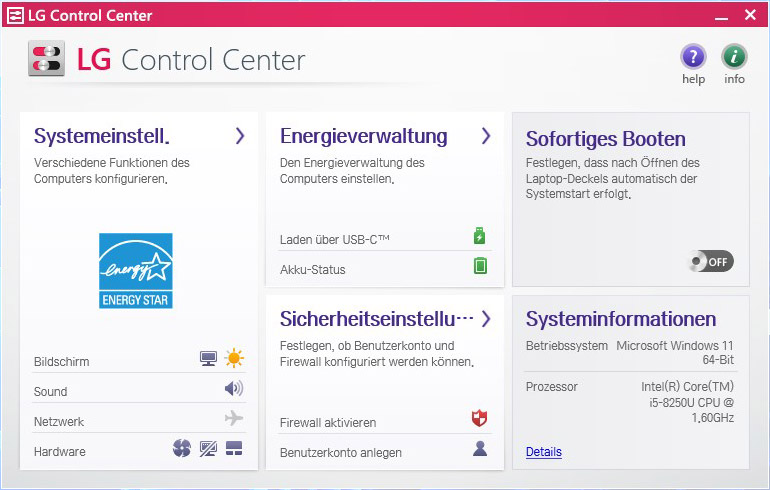

# Old Software for LG Notebooks

LG Update Center does not deliver LG Control Center Application anymore on old LG Gram Notebooks.
My first suggestion would be to try out the successor "LG Smart Assistant", maybe it is backwards compatible to your older Gram.

If not, you have to look for the old LG Control Center

If you know the filename, you can find some old versions. But I wasn't able to find anything after 2016. [2016_LGCtrlCenterW10_64b_v1512.zip](https://github.com/Falcosc/OldLGGram/raw/main/2016_LGCtrlCenterW10_64b_v1512.zip)

For that reason, I provided the program folder of the latest LG Control Center version extracted from an LG Gram 14Z970 installation. [2018_LG_Control_Center_FilesOnly.zip](https://github.com/Falcosc/OldLGGram/raw/main/2018_LG_Control_Center_FilesOnly.zip)

The 2018 Version does even work without installation, and some functions also work on my 2023 15Z90RT. 
So maybe it could be helpful if you have something more recent than 2018 without support for "LG Smart Assistant". 
For example 2023 Models don't need it, they use the still available successor "LG Smart Assistant"

## LG Control Center Automation

If you monitor DLL calls during using the LG Control Center UI, you can pick up which DLL provides which functionality.

After resolving all dependencies you can use them in scripts, for example [silentMode.ps1](silentMode.ps1) does automate fan curve adjustment.